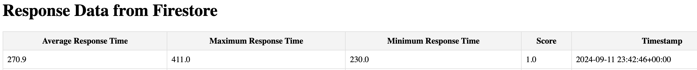

# Fall 2024 Mini Project assignment by Lucia Gil and Andrew Sasamori

## Exercise 1: Applications of Analog Input

1. what are the "max_bright" and "min_bright" values you found?

`max_bright` value that corresponded to LED duty cycle of about 100% was found at ~**43000**

`min_bright` value that corresponded to LED duty cycle of about 0% was found at ~**19000**

#### Example output of first few values

```txt
19460
19860
22277
22597
22853
22965
23029
23877
27062
28743
28454
28246
25574
23957
25670
26662
26694
28198
31367
31415
29687
24565
25158
32071
37161
40953
41786
41834
42378
42474
42474
42650
42634
42714
42970
42954
43050
42954
42970
43114
42810
42378
42426
```

## Exrcise 2: Sound

1. Using the code in exercise_sound.py as a starting point, modify the code to play several notes in a sequence from a song of your choosing.

We decided to play the song "Happy Birthday", we first found the frequency of the notes:

```txt
Notes For Happy Birthday
C4 = 261.63
D4 = 293.66
E4 = 329.63
F4 = 349.23
G4 = 392.00
A4 = 440.00
B4 = 493.88
C5 = 523.25
```

Then we created an array with the notes the duration and the correct order the notes shoud be played:

```python
happy_birthday = [
    (C4, 1), (C4, 1), (D4, 1), (C4, 1), (F4, 1), (E4, 2),
    (C4, 1), (C4, 1), (D4, 1), (C4, 1), (G4, 1), (F4, 2),
    (C4, 1), (C4, 1), (C5, 1), (A4, 1), (F4, 1), (E4, 1), (D4, 2),
    (B4, 1), (B4, 1), (A4, 1), (F4, 1), (G4, 1), (F4, 2)
]
```

Then we wrote a loop for the notes to be played.

## Exrcise 3: Game

1. Edit the exercise_game.py code to compute average, minimum, maximum response time for 10 flashes total.

The follwing code was added to compute the average, minimum, maximum and the score:

```python
    data = {
        "avg_resp_time": sum(t_good) / len(t_good),
        "min_resp_time": min(t_good),
        "max_resp_time": max(t_good),
        "score": 1 - misses / len(t)
    }
```

We also changed the variable N from 3 to 10, since we need 10 flashes;

```python
N: int = 10
```

2. Upload the response time data to a cloud service of your choice.

First, needed to make sure that the Pico connected to the internet fine. Did so with the following script.

```python
import time
import network

def connect_to_internet(ssid, password):
    # Pass in string arguments for ssid and password

    # Just making our internet connection
    wlan = network.WLAN(network.STA_IF)
    wlan.active(True)
    wlan.connect(ssid, password)

    # Wait for connect or fail
    max_wait = 10
    while max_wait > 0:
      if wlan.status() < 0 or wlan.status() >= 3:
        break
      max_wait -= 1
      print('waiting for connection...')
      time.sleep(1)
    # Handle connection error
    if wlan.status() != 3:
       raise RuntimeError('network connection failed')
    else:
      print('connected')
      status = wlan.ifconfig()

connect_to_internet('<sample_internet_name>', '<sample_internet_password>')
```

Source: https://github.com/shillehbean/youtube-channel/blob/main/internet_connection_pico_w.py

Needed to create a Firebase project and connect through the Firebase console webpage. Since this project is not a Firebase Web App/Firebase Web API, there is no Web API Key associated with it.


Instead, the Raspberry Pi Pico can connect to the Firestore Database through an OAuth Token.

You can do so by going to Project Settings -> Service Accounts -> Python -> Generate New Private Key

This will result in a JSON file that contains the key, but you will need to extract it. In order to do that, need to run the following script. (Need to install the following google dependencies before so.)

```sh
pip install google-auth google-auth-oauthlib google-auth-httplib2
```

```python
import google.auth
from google.auth.transport.requests import Request
from google.oauth2 import service_account

# Load the service account credentials from JSON file
SERVICE_ACCOUNT_FILE = '/Users/andrew/Desktop/new_key.json'

# Specify the correct scope for Firestore
SCOPES = ['https://www.googleapis.com/auth/datastore']

# Create credentials object with the Firestore scope
credentials = service_account.Credentials.from_service_account_file(
    SERVICE_ACCOUNT_FILE, scopes=SCOPES)

# Refresh the token to get a new OAuth 2.0 access token
credentials.refresh(Request())

# Get the OAuth 2.0 token
token = credentials.token

print("OAuth 2.0 Token:", token)
```

Retrieve this OAuth token, and then append the token to the exercise_game.py file.

After running and playing the exercise_game, the DB has been stored as intended:


Now need to display this information to a webpage.

Firebase and Google Cloud share the same project information, so can easily share the project over. To link to Google Cloud (in Firebase), go to Project Settings -> Service Accounts -> All Service Accounts.

Needed to initially create a new service account to gain access to the database. Give this user permission to edit, as well as create keys on local computer.


After doing that, create key to local computer. Need to then create a local environment for `GOOGLE_APPLICATION_CREDENTIALS`. Can do so by:

```sh
export GOOGLE_APPLICATION_CREDENTIALS="/path_to_your/service-account-file.json"
```

Verify this by doing:

```sh
echo $GOOGLE_APPLICATION_CREDENTIALS
```

Now verify that the Google Cloud can connect to your Firebase account (sample script):

```python
from google.cloud import firestore

def main():
    # Initialize Firestore
    db = firestore.Client()

    # Query Firestore data
    try:
        docs = db.collection('name_of_firebase_collection').get()
        for doc in docs:
            print(doc.to_dict())
    except Exception as e:
        print(f"Error: {e}")

if __name__ == "__main__":
    main()
```

When successful, created dummy Flask website via python script and HTML document. To install Flask run the following script:

```sh
pip install Flask google-cloud-firestore
```

Site was ran locally and received the following:



_Note: This timestamp correlates to the Firestore Database image from before, since Firebase records in timezone of UTC-4_

[Cloud Demo](https://drive.google.com/file/d/1MUPvWGaBB8RsGeKavXcnYm9I2UoZ-6hB/view?usp=sharing)